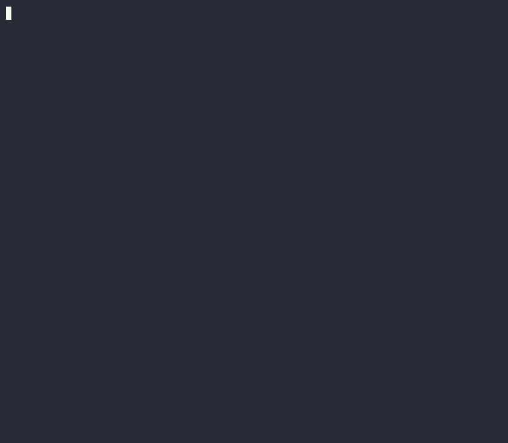

<picture>
  <source media="(prefers-color-scheme: dark)" srcset="docs/assets/cli-modelarium-wordmark-dark.svg">
  
</picture>

Leia isto em outros idiomas: [English](README.md) | [日本語](README.ja.md) | [Español](README.es.md) | [Français](README.fr.md) | [한국어](README.ko.md) | [中文](README.zh.md) | [Deutsch](README.de.md) | [Italiano](README.it.md)

Nota: Este README é traduzido para acessibilidade. A própria ferramenta CLI Cli Modelarium produz saída apenas em inglês. Todos os comandos, mensagens de erro e saídas permanecem em inglês, independentemente da localização do sistema.

> Nota: sete seções existem apenas no README em inglês — *Reproducibility analysis*, *Statistical significance testing*, *Bootstrap confidence intervals*, *Paired tests for same-prompt comparisons*, *McNemar's test for hallucination significance*, *Headless Linux servers* e *More examples*. Os recursos em si estão totalmente disponíveis; o que falta aqui é apenas a documentação deles. Consulte [README.md](https://github.com/SoraVantia/cli-modelarium/blob/main/README.md).

> Compare saídas de LLM lado a lado do seu terminal - 11 provedores de nuvem + modelos locais, com streaming paralelo, avaliação em lote, pontuação LLM-as-judge, detecção de alucinação e asserções prontas para CI/CD.

[](https://github.com/SoraVantia/cli-modelarium/actions/workflows/ci.yml)
[](https://pypi.org/project/cli-modelarium/)
[](https://pepy.tech/project/cli-modelarium)
[](LICENSE)
[](https://www.python.org/downloads/)
[](#)

```bash
pip install cli-modelarium
```

<p align="center">
  
</p>

## O que ele faz

**Cli Modelarium** é uma ferramenta de linha de comando refinada para comparar saídas de LLM entre provedores, modelos, prompts de sistema e temperaturas - com streaming paralelo ao vivo, avaliação em lote, testes determinísticos e pontuação de qualidade integrados.

Útil para avaliar qual modelo se adequa à sua tarefa específica, executar testes de regressão de prompts em CI/CD, comparar modelos locais com APIs em nuvem ou construir conjuntos de dados de avaliação - tudo a partir de um único comando de terminal.

## Requisitos de sistema

- Python 3.11 ou superior (usuários do Python 3.10: instale `cli-modelarium==0.1.1`)
- ~350 MB de espaço em disco (scipy e numpy representam cerca de dois terços)
- macOS (Apple Silicon e Intel), Windows 10+ (x64 e ARM), Linux (x64 e ARM)
- Acesso à internet para a primeira instalação (download do wheel do PyPI)

## Início rápido

```bash
pip install cli-modelarium

# Configurar chaves de API (salvas com segurança no keychain do seu SO)
cli-modelarium configure

# Execute sua primeira comparação
cli-modelarium "Explain quantum computing in one sentence" \
  --models gpt-5.5,claude-opus-4-8,gemini-3.1-pro-preview \
  --temperatures 0,0.7
```

É isso. Você verá os três modelos transmitirem suas respostas ao vivo em paralelo, com latência, contagens de tokens e custo exibidos em uma tabela de comparação limpa.

## Recursos

### 🤖 Provedores (11 na nuvem + locais ilimitados)

- **Provedores de nuvem:** OpenAI, Anthropic, Google (Gemini), xAI (Grok), DeepSeek, Mistral, Groq, OpenRouter, Alibaba (DashScope), Z.AI (GLM), NVIDIA (NIM)
- **Modelos locais:** Ollama, LM Studio, vLLM, llama.cpp - qualquer servidor compatível com OpenAI em execução no localhost
- Combine modelos locais e em nuvem na mesma comparação
- Escolha qualquer ID de modelo registrado por chamada - sem se limitar aos atalhos de grupo integrados

### ⚡ Streaming paralelo

- Exibição ao vivo token por token em todos os modelos simultaneamente
- Rastreamento de Time-to-First-Token (TTFT) por modelo
- Veja qual modelo termina primeiro, observe as saídas divergirem em tempo real
- Streams de todos os 11 provedores (SSE por baixo)

<p align="center">
  
</p>

**Nota de preços:** os valores de custo nas demos são de uma única execução no momento da gravação. Os preços mudam; verifique com o provedor antes de confiar em qualquer valor.

### 📊 Múltiplos modos de comparação

- **Prompt único vs. múltiplos modelos** - comparações rápidas de "qual é o melhor?"
- **Prompt único vs. múltiplas temperaturas** - veja como a aleatoriedade afeta a saída
- **Múltiplos prompts de sistema vs. um prompt de usuário** - teste A/B de engenharia de prompts
- **Modo em lote** - multi-prompt × multi-modelo para trabalho de avaliação real
- **Comparações local vs. nuvem** - quantifique a lacuna (ou a ausência dela)

### 🧪 Recursos de avaliação

- **Análise estatística de reprodutibilidade** - `--runs N` executa cada configuração N vezes e relata média/mediana/desvio padrão/CV de latência e tokens, frequência de saída, saída modal e diversidade de saída. Combine com `--check-hallucination` para medir a taxa de alucinação ao longo das execuções.
- **Asserções determinísticas** - 10 tipos de asserção (`contains`, `regex`, `json_valid`, `json_schema`, `max_length_chars`, `latency_under`, `cost_under` e mais) com saída de aprovado/falhou e códigos de saída de CI
- **Pontuação LLM-as-a-judge** - Use um LLM para pontuar as saídas de outros LLMs em critérios de qualidade
- **Painéis de juízes** - Múltiplos juízes calculam a média das pontuações para avaliação menos enviesada
- **Preset de detecção de alucinação** - Critérios prontos para uso para verificação de precisão factual
- **Critérios personalizados** - Defina suas próprias rubricas de pontuação
- **Auto-pular auto-avaliação** - Modelos juízes automaticamente pulados quando também estão sendo julgados

<p align="center">
  
</p>

### 💾 Formatos de saída

- **Terminal ao vivo** - Painéis baseados em Rich com barras de progresso e exibição de streaming
- **CSV** - Amigável a planilhas (abra no Excel, Google Sheets, pandas)
- **JSON** - Estruturado para scripts e pipelines
- **Markdown** - Tabelas bonitas para postagens de blog e relatórios
- **Códigos de saída** - 0/1/2 refletindo status de aprovado/falhou para CI/CD

### 💰 Transparência de custos

- Custo por chamada exibido a partir do uso reportado por cada provedor
- Resumo de custo total por comparação
- Custo do juiz mostrado separadamente quando LLM-as-judge está habilitado
- Modelos locais exibidos como "Free"
- Flag `--max-cost` para evitar contas surpresa

### 🔒 Segurança

- Chaves de API armazenadas no keychain nativo do SO via `keyring` (Mac Keychain, Windows Credential Manager, Linux Secret Service)
- Validação de formato captura erros de colagem antes do armazenamento
- Redação de mensagens de erro previne vazamento de chaves em tracebacks
- Validação somente localhost para URLs de modelos locais
- `SECURITY.md` com política de divulgação responsável

### 🛡️ Tratamento de limites de taxa

- Limites de concorrência por provedor (padrão 5) respeitam todas as baselines de tier
- Retentativa automática de 429 com backoff exponencial
- 529 "overloaded" do Anthropic tratado separadamente dos limites de taxa
- Flag `--concurrency` para usuários avançados em tiers superiores
- Falha graciosa por modelo (outros modelos continuam)
- Os limites de taxa do tier gratuito do DashScope e do Qwen carro-chefe (qwen3.7-max) são mais restritos que os da maioria dos provedores; reduza `--concurrency` se você encontrar erros 429.

### 🌐 Multiplataforma

- Funciona de forma idêntica em macOS, Windows (10+ e ARM) e Linux
- Todo I/O de arquivo usa `pathlib` + codificação UTF-8 explícita
- Escrita CSV usa `newline=""` para compatibilidade com Windows
- Python 3.11+ requerido

### 📋 Experiência do desenvolvedor

- **Binário CLI único** - `pip install cli-modelarium` e pronto
- **UI refinada baseada em Rich** - Polimento de terminal no nível Claude Code
- **Saída JSON** - Encaminhe para qualquer coisa (`jq`, scripts, monitoramento)
- **Pronto para CI/CD** - Códigos de saída, saída estruturada, exemplo de GitHub Actions incluído
- **Licenciado sob Apache 2.0** - Use em qualquer projeto, comercial ou não

## Exemplos

### Compare 3 modelos em uma tarefa de programação

```bash
cli-modelarium "Write a Python function to find the longest palindromic substring" \
  --models gpt-5.5,claude-opus-4-7,gemini-3.1-pro-preview
```

### Avaliação em lote com asserções

Crie `eval.json`:

```json
[
  {
    "id": "math-1",
    "prompt": "What is 2 + 2?",
    "assertions": [
      {"type": "contains", "value": "4"},
      {"type": "max_length_chars", "value": 100}
    ]
  },
  {
    "id": "json-1",
    "prompt": "List 3 colors in JSON array format",
    "assertions": [
      {"type": "json_valid"}
    ]
  }
]
```

Execute-o:

```bash
cli-modelarium batch eval.json \
  --models gpt-5.5,claude-opus-4-7 \
  --output results.csv
```

### Pontue saídas com um juiz LLM

```bash
cli-modelarium "Explain recursion in one paragraph" \
  --models gpt-5.5,claude-opus-4-7,gemini-3.1-pro-preview,local/llama-3.3-70b \
  --judge claude-opus-4-7 \
  --judge-criteria "accuracy,clarity,brevity"
```

<p align="center">
  
</p>

**Nota da demonstração:** as pontuações e os valores de custo são de uma única execução no momento da gravação. As pontuações do juiz são um sinal, não uma verdade absoluta, e não se reproduzem exatamente entre execuções ou versões de modelo. Os preços mudam; verifique com o provedor antes de confiar em qualquer valor.

### Detecte alucinações contra fatos conhecidos

```bash
cli-modelarium "Tell me about the Eiffel Tower" \
  --models gpt-5.5,claude-opus-4-7 \
  --judge claude-opus-4-7 \
  --check-hallucination \
  --expected-facts "Built 1887-1889,Located in Paris France,Designed by Gustave Eiffel"
```

### Compare modelo local com APIs em nuvem

```bash
# Inicie o Ollama primeiro: ollama run llama3.3
cli-modelarium "Summarize the key features of microservices architecture" \
  --models local/llama-3.3-70b,gpt-5.5,claude-opus-4-7
```

### Execute em CI/CD (exemplo de GitHub Actions)

```yaml
- name: Run LLM evaluation
  env:
    OPENAI_API_KEY: ${{ secrets.OPENAI_API_KEY }}
    ANTHROPIC_API_KEY: ${{ secrets.ANTHROPIC_API_KEY }}
  run: |
    cli-modelarium batch ./eval/test_suite.json \
      --models gpt-5.5,claude-opus-4-7 \
      --output eval_results.json \
      --min-pass-rate 0.90
```

O comando sai com código 1 se a taxa de aprovação cair abaixo de 90%, fazendo o build falhar.

#### Códigos de saída

| Código | Significado |
|--------|-------------|
| `0` | Sucesso. |
| `1` | Falha de asserção - uma ou mais asserções não passaram. Apenas `batch`; `compare` não tem asserções. |
| `2` | A execução não pôde ser concluída. |

O código `2` abrange várias causas distintas e **não distingue entre elas**: uma chave de API ausente, um modelo desconhecido, um modelo descontinuado, um erro do provedor, um limite de custo excedido, um arquivo de lote malformado, uma combinação de flags rejeitada, um conflito no arquivo de saída ou um limite de tamanho de lote excedido.

Vale conhecer duas regras antes de basear um pipeline nesses códigos:

- **Falhas de chamada prevalecem sobre asserções.** Se alguma chamada ao modelo falhar, `batch` sai com `2` sem informar o veredito das asserções, mesmo que estas também tenham falhado. Uma suíte vermelha e uma chave de API inválida parecem iguais pelo código de saída.
- **Um servidor local inacessível não é uma falha.** `list-models --local` sai com `0` quando nenhum servidor responde, portanto o código de saída não serve para detectá-lo.

Para descobrir *por que* uma execução falhou, leia o campo `error` de cada resultado na saída JSON - ele traz a mensagem do provedor, com cadeias parecidas com credenciais redigidas:

```bash
cli-modelarium batch ./eval/test_suite.json \
  --models gpt-5.5,claude-opus-4-7 \
  --output-format json --output results.json
code=$?
if [ "$code" -eq 2 ]; then
  jq -r '.results[] | select(.error) | "\(.model): \(.error)"' results.json
fi
```

`--output-format json` é obrigatório: a saída padrão não inclui nenhum campo de erro legível por máquina. Observe que as falhas que ocorrem *antes* de qualquer chamada ao modelo (chave ausente, modelo desconhecido, arquivo de lote incorreto) não produzem JSON algum; nesses casos a mensagem no console é o único sinal.

**Nota de privacidade:** todos os formatos de saída - JSON, CSV e Markdown - incluem o prompt completo e a resposta completa do modelo de cada resultado, junto com quaisquer mensagens de erro do provedor. O JSON inclui ainda o texto de raciocínio de cada juiz; `--include-reasoning` controla apenas a exibição no console, não o arquivo, e CSV e Markdown não o contêm. Trate qualquer arquivo de saída como sensível antes de fazer commit ou enviá-lo como artefato público de CI.

## Configuração

### Chaves de API

Cli Modelarium armazena chaves de API no keychain nativo do seu SO (Mac Keychain, Windows Credential Manager ou Linux Secret Service via `keyring`). As chaves nunca tocam o disco em texto simples.

```bash
# Configuração interativa (recomendada)
cli-modelarium configure

# Ou defina individualmente
cli-modelarium keys set openai
cli-modelarium keys set anthropic
cli-modelarium keys set google

# Verifique quais chaves estão configuradas
cli-modelarium keys list

# Remover uma chave
cli-modelarium keys delete openai
```

Você também pode usar variáveis de ambiente (útil para CI/CD):

```bash
export OPENAI_API_KEY=sk-...
export ANTHROPIC_API_KEY=sk-ant-...
export GOOGLE_API_KEY=...
```

Variáveis de ambiente têm precedência sobre o armazenamento do keychain.

### Modelos locais (Ollama, LM Studio, etc.)

Modelos locais funcionam via endpoints compatíveis com OpenAI - sem chaves de API necessárias. A ferramenta detecta automaticamente a porta padrão do Ollama.

```bash
# Padrão: assume Ollama em localhost:11434
cli-modelarium "test" --models local/llama-3.3

# Use LM Studio em vez disso
cli-modelarium "test" --models local/qwen-3-32b --local-url http://localhost:1234/v1

# Salve uma URL local personalizada como padrão
cli-modelarium keys set local --base-url http://localhost:1234/v1
```

## Provedores suportados

| Provedor | Chaves de API Necessárias | Streaming | Rastreamento de Custos |
|----------|-----------------|-----------|---------------|
| OpenAI (GPT-5, GPT-5 mini, o3, o4-mini, etc.) | ✅ | ✅ | ✅ |
| Anthropic (Claude Opus 4.8, Sonnet 4.6, Haiku 4.5, etc.) | ✅ | ✅ | ✅ |
| Google (Gemini 3.5 Flash, Gemini 3.1 Pro, etc.) | ✅ | ✅ | ✅ |
| xAI (Grok 4.3, etc.) | ✅ | ✅ | ✅ |
| DeepSeek (V4 Pro, V4 Flash, etc.) | ✅ | ✅ | ✅ |
| Mistral (Large, Medium, Small) | ✅ | ✅ | ✅ |
| Groq (Llama 3.3, Llama 4 Scout, gpt-oss) | ✅ | ✅ | ✅ |
| OpenRouter (8 IDs registrados: Qwen, DeepSeek R1, Llama 3.3, gpt-oss, GLM) | ✅ | ✅ | ✅ |
| Alibaba/DashScope (Qwen3.7 Max, Qwen3.6 Flash, Qwen3 Coder, etc.; modelos Qwen selecionados, Internacional/Singapura) | ✅ | ✅ | ✅ |
| Z.AI/GLM (GLM-5.2, GLM-4.7, GLM-4.5 Air, etc.; compatível com OpenAI, endpoint internacional) | ✅ | ✅ | ✅ |
| NVIDIA NIM (9 IDs registrados: Nemotron, Gemma 4, Mistral Nemotron, MiniMax M3, Laguna, Llama 3.1) | ✅ | ✅ | Sem tarifa publicada |
| **Local: Ollama** | ❌ | ✅ | Gratuito |
| **Local: LM Studio** | ❌ | ✅ | Gratuito |
| **Local: vLLM** | ❌ | ✅ | Gratuito |
| **Local: llama.cpp server** | ❌ | ✅ | Gratuito |

Execute `cli-modelarium list-models` para ver todos os modelos atualmente suportados.

## Grupos de modelos

Em vez de listar IDs de modelos, `--models` aceita um atalho de grupo. Os grupos estáticos são expandidos literalmente: todos os membros listados abaixo são executados, então você precisa de uma chave para cada provedor que o grupo abrange, e a execução é abortada na primeira que faltar. Os grupos dinâmicos `all` e `all-local` são a exceção - esses são resolvidos de acordo com o que você realmente tem configurado.

**Grupos estáticos** (composição fixa):

| Grupo | Modelos |
|-------|---------|
| `all-premium` / `all-flagship` | gpt-5.6-sol, claude-opus-5, gemini-3.1-pro-preview, grok-4.6, deepseek-v4-pro, mistral-large-latest, qwen3.8-max, glm-5.2 |
| `all-budget` | gpt-5.4-nano, claude-haiku-4-5, gemini-3.1-flash-lite, grok-4.20-0309-non-reasoning, deepseek-v4-flash, mistral-small-latest, qwen3.7-plus, glm-4.5-air |
| `all-reasoning` | o3, o4-mini, deepseek-v4-pro, magistral-medium-latest, magistral-small-latest, glm-5.2 |
| `all-cheap` | gpt-4o-mini, claude-haiku-4-5, gemini-2.5-flash-lite, deepseek-v4-flash, mistral-small-latest, qwen-flash, glm-4.7-flashx |
| `all-open-weight` | openai/gpt-oss-120b, openai/gpt-oss-safeguard-20b, llama-3.3-70b-versatile, meta-llama/llama-4-scout-17b-16e-instruct |

**Grupos dinâmicos** (resolvidos em tempo de execução):

- `all` — todos os modelos em nuvem para os quais você tem uma chave de API configurada (exclui modelos locais, OpenRouter e NVIDIA: estes dois últimos são um subconjunto registrado e não o catálogo completo do provedor, e o custo da NVIDIA não pode ser informado). Isso pode se expandir para muitos modelos, então combine com `--max-cost`.
- `all-local` — todos os modelos reportados pelo seu servidor local em execução (Ollama / LM Studio / vLLM / llama.cpp). Se nenhum servidor estiver acessível, você recebe uma mensagem clara em vez de um erro.

```bash
cli-modelarium "Explique o teorema CAP" --models all-budget
cli-modelarium "Explique o teorema CAP" --models all --max-cost 0.50
cli-modelarium "Explique o teorema CAP" --models all-local
```

## Como funciona

Cli Modelarium usa uma camada de abstração de provedor modular que oculta as diferenças de API entre o array `messages` do OpenAI, o parâmetro `system` de nível superior do Anthropic, o `system_instruction` do Google e outros. Cada provedor implementa a mesma interface de streaming assíncrono, então a CLI pode executá-los todos em paralelo com `asyncio.gather()`.

Os cálculos de custo vêm do campo `usage` reportado por cada provedor (tokens de entrada, tokens de saída, tokens em cache) multiplicado pelas constantes de preço atuais. Os dados de preço foram verificados a partir da documentação oficial do provedor em **29 de julho de 2026** - veja [Notas e Limitações](#notas-e-limitações) para ressalvas.

Para modelos locais, o mesmo SDK Python da OpenAI é usado com uma `base_url` personalizada, já que Ollama, LM Studio, vLLM e llama.cpp expõem endpoints REST compatíveis com OpenAI.

## Notas e Limitações

### Dados de preço

A maior parte dos preços incorporados ao Cli Modelarium foi verificada a partir da documentação oficial do provedor em **29 de julho de 2026**. Algumas entradas carregam sua própria data de verificação, anotada ao lado de cada uma no registro; os preços da Z.AI/GLM são os mais antigos, de **22 de junho de 2026**. Os preços de LLM mudam com frequência (às vezes mensalmente). A data `pricing_as_of` é incluída na saída JSON e exibida no console; a saída CSV e Markdown não a inclui. Sempre verifique com a página oficial de preços de cada provedor antes de confiar em cálculos de custo para orçamento ou decisões de produção.

Os preços são a tarifa pública padrão/de tabela de cada provedor por 1M de tokens (não preços em lote, prioritários, fora de pico ou promocionais); para modelos com tiers baseados no tamanho da entrada, é exibido o tier inicial/de contexto curto, e o preço em cache é a tarifa de leitura de cache. Os custos do DashScope/Qwen refletem as tarifas sem raciocínio (a ferramenta envia `enable_thinking=false`).

A NVIDIA NIM é a exceção. A NVIDIA não publica nenhuma tarifa por token para seus endpoints NIM hospedados, portanto o custo não é rastreado para os modelos da NVIDIA: o zero exibido na coluna de custo é a ausência de uma tarifa, não um preço igual a zero. Como esse custo é sempre zero, `--max-cost` nunca será acionado em um modelo da NVIDIA e uma asserção `cost_under` sempre será aprovada - nenhum dos dois oferece qualquer proteção de gastos neste provedor. O acesso é medido em créditos da conta em vez de faturado por token, portanto o que se deve observar é o esgotamento dos créditos, não uma fatura inesperada. Um painel de advertência é exibido sempre que um modelo da NVIDIA faz parte de uma execução.

Execute `cli-modelarium pricing` (ou `pricing --all`) para as tarifas atuais por modelo.

### Limites de taxa

O tratamento de limites de taxa e as configurações padrão de concorrência por provedor são baseados nos limites de taxa do provedor verificados em **21 de junho de 2026**. Os limites do seu tier específico podem diferir dos padrões assumidos aqui. Verifique seus limites atuais no painel oficial do provedor antes de construir suposições de capacidade de produção.

### Disponibilidade do modelo

Os modelos suportados pelo Cli Modelarium refletem o que os provedores ofereciam em **15 de agosto de 2026**. Os provedores regularmente lançam novos modelos, descontinuam os mais antigos e ajustam capacidades. Se um modelo no registro não funcionar mais, execute `cli-modelarium list-models` e consulte a documentação do provedor.

### Não é um gateway de produção

Cli Modelarium foi projetado para avaliação e comparação - executando testes ad-hoc lado a lado entre provedores a partir de um terminal de desenvolvedor. NÃO é um gateway de inferência de produção. Se você precisa de roteamento em escala de produção, balanceamento de carga, cadeias de fallback ou inferência gerenciada por SLA, procure ferramentas construídas especificamente para esse propósito.

### Comparações de contagem de tokens entre provedores

As contagens de tokens mostradas nos resultados são reportadas pela API de cada provedor. Diferentes provedores usam diferentes tokenizadores, então "tokens de saída" não é diretamente comparável entre provedores para o mesmo texto. Se você está comparando eficiência de custo para uso em produção, execute prompts reais em sua carga de trabalho real - não confie apenas em cálculos por token entre provedores.

### Uso de LLM-as-a-Judge

Cli Modelarium inclui pontuação LLM-as-a-judge opcional (habilitada com a flag `--judge`), que usa um LLM para avaliar saídas de outros LLMs. Esta é uma metodologia padrão de benchmarking e é permitida sob os Termos de Serviço de todos os provedores suportados como atividade de avaliação/benchmarking.

Ao usar `--judge`, você é responsável por seguir os Termos de Serviço de cada provedor cujos modelos você usa. Os ToS de cada provedor se aplicam tanto aos modelos sendo julgados quanto ao próprio modelo juiz.

**Aviso de viés do juiz:** Juízes LLM têm vieses documentados (preferência pelo próprio, preferência pela mesma família, preferência por verbosidade). Pontuações do juiz são sinal útil, não verdade fundamental. Use painéis de juízes (`--judges` com múltiplos modelos) para reduzir viés.

### Detecção de alucinações

O preset de detecção de alucinações é um sinal de comparação útil entre modelos, não uma validação de verdade fundamental. A precisão da detecção varia com base no modelo juiz usado, no conhecimento de domínio necessário e se os fatos de referência são fornecidos via `--expected-facts`. Use-o para comparação de qualidade relativa, não para verificação de correção absoluta.

### Metodologia de comparação

LLMs são não determinísticos em temperatura > 0 - executar novamente o mesmo prompt pode produzir saídas diferentes. Uma única execução de comparação mostra UMA amostra de cada modelo, não um veredicto de qualidade definitivo.

Para tirar conclusões mais confiáveis:
- Use `--runs 5` (ou mais) para executar automaticamente cada comparação N vezes e ver resumos estatísticos: latência média/mediana, coeficiente de variação, saída modal e diversidade de saída. Um coeficiente de variação abaixo de 0,05 indica comportamento estável do modelo entre as execuções.
- Para a análise de consistência de alucinações, combine `--runs` com `--check-hallucination` para ver com que frequência o modelo produz alucinações ao longo de várias execuções (a taxa de alucinação).
- Use `--temperatures 0` para saídas mais determinísticas. Alguns modelos não aceitam nenhuma configuração de temperatura - `claude-opus-4-7`, `claude-opus-4-8`, `claude-opus-5`, `claude-sonnet-5`, `claude-fable-5`, `o3`, `o4-mini`, `gpt-5`, `gpt-5.5`, `gpt-5.6-sol`, `gpt-5.6-terra` e `gpt-5.6-luna`. A ferramenta omite o campo para esses modelos para que a chamada ainda funcione, e eles são executados com o valor padrão do provedor.
- Compare entre múltiplos prompts, não apenas um
- Use a flag `--output json` para salvar execuções para análise sistemática (com `--runs > 1` o JSON inclui agregados `stats_by_cell` por célula)

Esses doze modelos são chamados sem o campo de temperatura, e `models_without_temperature` na saída JSON nomeia os afetados em cada execução. Vale conhecer três consequências. Uma varredura `--temperatures` com vários valores emite requisições idênticas em vez de uma varredura real contra esses modelos, e a ferramenta exibe um aviso quando isso acontece. A temperatura mostrada na tabela de resultados, no CSV e em cada registro de resultado JSON é o valor **solicitado**, não o aplicado. E `--significance` é onde isso pode mudar uma conclusão em vez de um rótulo: comparar um modelo que omite a temperatura com outro que a respeita produz uma diferença de variância que é um artefato de amostragem, e Welch ou Mann-Whitney a reportarão como se fosse uma diferença de qualidade entre modelos. Esse caso é avisado: qualquer execução de significância que misture um modelo afetado com um não afetado imprime um painel `Temperature not applied` nomeando os modelos que rodaram na temperatura padrão do provedor, e define `significance_temperature_mixed` como `true` na saída JSON. Uma execução com várias temperaturas que também seja mista recebe as duas mensagens em um único painel. O CSV não carrega um sinal equivalente.

## Sobre o projeto

Cli Modelarium é um produto da **SoraVantia GK**. Foi originalmente criado por **Lavelle Hatcher Jr**, que continua a mantê-lo.

- 📦 Repositório: [github.com/SoraVantia/cli-modelarium](https://github.com/SoraVantia/cli-modelarium)
- 💬 Dúvidas ou bugs: [abra uma issue](../../issues)
- 🔧 Mantenedor: [Lavelle Hatcher Jr](https://linkedin.com/in/lavellehatcherjr)

## Por que eu construí isso

Comparar saídas de LLM entre provedores é tedioso - diferentes SDKs, diferentes padrões de autenticação, diferentes formas de resposta, nenhuma maneira fácil de vê-los lado a lado com dados de custo e latência. Os refinados playgrounds em nuvem mostram apenas um provedor por vez, e as opções de código aberto disponíveis ou focam em roteamento de produção ou são plataformas de avaliação completas otimizadas para equipes.

Cli Modelarium é a pequena ferramenta CLI focada que faz uma coisa bem: comparação lado a lado com pontuação de qualidade, asserções, modo em lote e streaming - tudo projetado para o fluxo de trabalho de desenvolvedor centrado no terminal.

É intencionalmente focado: sem roteamento de produção, sem orquestração de agente, sem fine-tuning, sem GUI. Apenas comparação limpa e rápida da linha de comando.

Construído com uma abstração de provedor modular, execução paralela, cálculo de custo transparente e armazenamento seguro de chaves via sistemas de keychain do SO para usuários locais.

## Contribuindo

Issues e PRs bem-vindos. Veja [CONTRIBUTING.md](CONTRIBUTING.md) para diretrizes.

Para problemas de segurança, por favor veja [SECURITY.md](SECURITY.md) - não abra issues públicas para preocupações de segurança.

## Licença

Licenciado sob a [Apache License, Version 2.0](LICENSE).

Veja o arquivo [NOTICE](NOTICE) para requisitos de atribuição.

---

Um produto da SoraVantia GK, criado e mantido por [Lavelle Hatcher Jr](https://linkedin.com/in/lavellehatcherjr)

Licenciado sob Apache 2.0. Issues, PRs e conversas bem-vindos.
