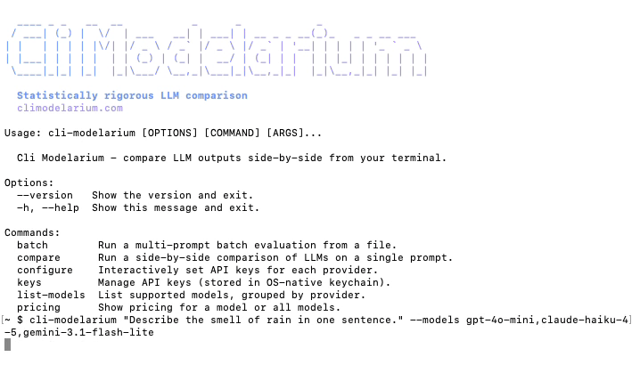

<picture>
  <source media="(prefers-color-scheme: dark)" srcset="docs/assets/cli-modelarium-wordmark-dark.svg">
  
</picture>

用其他语言阅读: [English](README.md) | [日本語](README.ja.md) | [Español](README.es.md) | [Français](README.fr.md) | [한국어](README.ko.md) | [Deutsch](README.de.md) | [Português](README.pt.md) | [Italiano](README.it.md)

注意: 此 README 是为了可访问性而翻译的。Cli Modelarium CLI 工具本身仅输出英文。无论系统区域设置如何，所有命令、错误消息和输出均保持英文。

> 注意：以下七个章节仅存在于英文 README 中 — *Reproducibility analysis*、*Statistical significance testing*、*Bootstrap confidence intervals*、*Paired tests for same-prompt comparisons*、*McNemar's test for hallucination significance*、*Headless Linux servers*、*More examples*。功能本身均可正常使用，此处缺少的只是它们的说明。请参阅 [README.md](https://github.com/SoraVantia/cli-modelarium/blob/main/README.md)。

> 在终端中并排比较 LLM 输出 - 11 个云服务提供商 + 本地模型，支持并行流式传输、批量评估、LLM-as-judge 评分、幻觉检测和 CI/CD 就绪的断言。

[](https://github.com/SoraVantia/cli-modelarium/actions/workflows/ci.yml)
[](https://pypi.org/project/cli-modelarium/)
[](https://pepy.tech/project/cli-modelarium)
[](LICENSE)
[](https://www.python.org/downloads/)
[](#)

```bash
pip install cli-modelarium
```

<p align="center">
  
</p>

## 功能简介

**Cli Modelarium** 是一款精心打造的命令行工具，用于跨提供商、模型、系统提示和温度参数比较 LLM 输出 - 内置实时并行流式传输、批量评估、确定性测试和质量评分。

适用于评估哪个模型适合您的特定任务、在 CI/CD 中运行提示回归测试、将本地模型与云 API 进行比较，或构建评估数据集 - 一切都通过单个终端命令完成。

## 系统要求

- Python 3.11 或更高版本（Python 3.10 用户请安装 `cli-modelarium==0.1.1`）
- 约 350 MB 磁盘空间（其中约三分之二为 scipy 和 numpy）
- macOS（Apple Silicon 和 Intel）、Windows 10+（x64 和 ARM）、Linux（x64 和 ARM）
- 首次安装需要联网（下载 PyPI wheel）

## 快速开始

```bash
pip install cli-modelarium

# 配置 API 密钥（安全保存到您的操作系统密钥链中）
cli-modelarium configure

# 运行您的第一次比较
cli-modelarium "Explain quantum computing in one sentence" \
  --models gpt-5.5,claude-opus-4-8,gemini-3.1-pro-preview \
  --temperatures 0,0.7
```

就这么简单。您将看到三个模型并行实时流式传输响应，延迟、令牌数和成本显示在简洁的比较表中。

## 特性

### 🤖 提供商（11 个云端 + 无限本地）

- **云服务提供商:** OpenAI、Anthropic、Google (Gemini)、xAI (Grok)、DeepSeek、Mistral、Groq、OpenRouter、Alibaba (DashScope)、Z.AI (GLM)、NVIDIA (NIM)
- **本地模型:** Ollama、LM Studio、vLLM、llama.cpp - 任何在 localhost 上运行的 OpenAI 兼容服务器
- 在同一比较中混合使用本地和云模型
- 每次调用可选择任何已注册的模型 ID - 不限于内置的分组快捷方式

### ⚡ 并行流式传输

- 同时跨所有模型逐令牌实时显示
- 每个模型的 Time-to-First-Token (TTFT) 跟踪
- 查看哪个模型首先完成，实时观察输出分歧
- 来自所有 11 个提供商的流（底层使用 SSE）

<p align="center">
  
</p>

**价格提示：** 演示中显示的成本来自录制时的单次运行。定价会变化；在依赖任何数字之前，请对照提供商进行验证。

### 📊 多种比较模式

- **单一提示 vs. 多个模型** - 快速"哪个最好？"比较
- **单一提示 vs. 多个温度** - 查看随机性如何影响输出
- **多个系统提示 vs. 一个用户提示** - A/B 测试提示工程
- **批量模式** - 用于实际评估工作的多提示 × 多模型
- **本地 vs. 云比较** - 量化差距（或其缺失）

### 🧪 评估功能

- **统计可复现性分析** - `--runs N` 将每个配置运行 N 次，并报告延迟和令牌的平均值/中位数/标准差/变异系数、输出频率、众数输出和输出多样性。与 `--check-hallucination` 结合使用可测量多次运行中的幻觉率。
- **确定性断言** - 10 种断言类型（`contains`、`regex`、`json_valid`、`json_schema`、`max_length_chars`、`latency_under`、`cost_under` 等），具有通过/失败输出和 CI 退出代码
- **LLM-as-a-judge 评分** - 使用一个 LLM 根据质量标准对其他 LLM 的输出进行评分
- **评判面板** - 多个评判平均得分以减少偏见的评估
- **幻觉检测预设** - 用于事实准确性检查的开箱即用标准
- **自定义标准** - 定义您自己的评分规则
- **自评自动跳过** - 当评判模型也是被评判对象时自动跳过

<p align="center">
  
</p>

### 💾 输出格式

- **实时终端** - 基于 Rich 的面板，带有进度条和流式显示
- **CSV** - 电子表格友好（在 Excel、Google Sheets、pandas 中打开）
- **JSON** - 为脚本和管道结构化
- **Markdown** - 用于博客文章和报告的精美表格
- **退出代码** - 反映 CI/CD 通过/失败状态的 0/1/2

### 💰 成本透明度

- 从每个提供商报告的使用情况显示每次调用成本
- 每次比较的总成本汇总
- 启用 LLM-as-judge 时单独显示评判成本
- 本地模型显示为 "Free"
- 通过 `--max-cost` 标志防止意外账单

### 🔒 安全性

- 通过 `keyring` 将 API 密钥存储在 OS 原生密钥链中（Mac Keychain、Windows Credential Manager、Linux Secret Service）
- 格式验证在存储前捕获粘贴错误
- 错误消息编辑防止密钥在回溯中泄漏
- 仅限 localhost 的本地模型 URL 验证
- 包含负责任披露政策的 `SECURITY.md`

### 🛡️ 速率限制处理

- 每个提供商的并发限制（默认 5）尊重所有层级基线
- 自动 429 重试，带指数退避
- Anthropic 的 529 "overloaded" 与速率限制分开处理
- 为较高层级的高级用户提供 `--concurrency` 标志
- 每个模型的优雅失败（其他模型继续）
- DashScope 免费层级和旗舰 Qwen (qwen3.7-max) 的速率限制比大多数提供商更严格；如果遇到 429，请降低 `--concurrency`

### 🌐 跨平台

- 在 macOS、Windows（10+ 和 ARM）和 Linux 上以相同方式工作
- 所有文件 I/O 使用 `pathlib` + 显式 UTF-8 编码
- CSV 写入使用 `newline=""` 以兼容 Windows
- 需要 Python 3.11+

### 📋 开发者体验

- **单一 CLI 二进制文件** - `pip install cli-modelarium` 即可完成
- **精致的基于 Rich 的 UI** - Claude Code 级别的终端打磨
- **JSON 输出** - 可通过管道输入任何工具（`jq`、脚本、监控）
- **CI/CD 就绪** - 退出代码、结构化输出、包含 GitHub Actions 示例
- **Apache 2.0 许可** - 可用于任何项目，商业或其他

## 示例

### 在编码任务上比较 3 个模型

```bash
cli-modelarium "Write a Python function to find the longest palindromic substring" \
  --models gpt-5.5,claude-opus-4-7,gemini-3.1-pro-preview
```

### 带断言的批量评估

创建 `eval.json`:

```json
[
  {
    "id": "math-1",
    "prompt": "What is 2 + 2?",
    "assertions": [
      {"type": "contains", "value": "4"},
      {"type": "max_length_chars", "value": 100}
    ]
  },
  {
    "id": "json-1",
    "prompt": "List 3 colors in JSON array format",
    "assertions": [
      {"type": "json_valid"}
    ]
  }
]
```

运行它:

```bash
cli-modelarium batch eval.json \
  --models gpt-5.5,claude-opus-4-7 \
  --output results.csv
```

### 使用 LLM 评判对输出进行评分

```bash
cli-modelarium "Explain recursion in one paragraph" \
  --models gpt-5.5,claude-opus-4-7,gemini-3.1-pro-preview,local/llama-3.3-70b \
  --judge claude-opus-4-7 \
  --judge-criteria "accuracy,clarity,brevity"
```

### 针对已知事实检测幻觉

```bash
cli-modelarium "Tell me about the Eiffel Tower" \
  --models gpt-5.5,claude-opus-4-7 \
  --judge claude-opus-4-7 \
  --check-hallucination \
  --expected-facts "Built 1887-1889,Located in Paris France,Designed by Gustave Eiffel"
```

### 将本地模型与云 API 进行比较

```bash
# 首先启动 Ollama: ollama run llama3.3
cli-modelarium "Summarize the key features of microservices architecture" \
  --models local/llama-3.3-70b,gpt-5.5,claude-opus-4-7
```

### 在 CI/CD 中运行（GitHub Actions 示例）

```yaml
- name: Run LLM evaluation
  env:
    OPENAI_API_KEY: ${{ secrets.OPENAI_API_KEY }}
    ANTHROPIC_API_KEY: ${{ secrets.ANTHROPIC_API_KEY }}
  run: |
    cli-modelarium batch ./eval/test_suite.json \
      --models gpt-5.5,claude-opus-4-7 \
      --output eval_results.json \
      --min-pass-rate 0.90
```

如果通过率低于 90%，命令将以代码 1 退出，从而使构建失败。

#### 退出代码

| 代码 | 含义 |
|------|------|
| `0` | 成功。 |
| `1` | 断言失败——一个或多个断言未通过。仅限 `batch`；`compare` 没有断言。 |
| `2` | 运行未能完成。 |

代码 `2` 涵盖多种不同的原因，并且**不区分它们**：缺少 API 密钥、未知模型、已停用的模型、提供商错误、超出成本上限、格式错误的批处理文件、被拒绝的标志组合、输出文件冲突，或超出批处理大小上限。

在让流水线依赖这些代码之前，有两条规则值得了解：

- **调用失败优先于断言。** 只要有一次模型调用失败，`batch` 就会以 `2` 退出而不报告断言结论，即便断言同样失败也是如此。从退出代码看，失败的测试套件和无效的 API 密钥并无区别。
- **无法访问本地服务器不算失败。** 即使没有服务器响应，`list-models --local` 仍以 `0` 退出，因此无法用退出代码来检测服务器是否运行。

若要了解运行*为何*失败，请读取 JSON 输出中每条结果的 `error` 字段——其中包含提供商的消息，形似凭据的字符串会被遮蔽：

```bash
cli-modelarium batch ./eval/test_suite.json \
  --models gpt-5.5,claude-opus-4-7 \
  --output-format json --output results.json
code=$?
if [ "$code" -eq 2 ]; then
  jq -r '.results[] | select(.error) | "\(.model): \(.error)"' results.json
fi
```

`--output-format json` 是必需的：默认输出不含任何机器可读的错误字段。请注意，在调用任何模型*之前*发生的失败（缺少密钥、未知模型、批处理文件有误）根本不会生成 JSON；此时控制台消息是唯一的信号。

**隐私提示：** JSON、CSV 和 Markdown 每种输出格式都会嵌入每条结果的完整提示词和完整模型响应，以及提供商的任何错误消息。在提交输出文件或将其作为公开 CI 产物上传之前，请将其视为敏感信息。

## 配置

### API 密钥

Cli Modelarium 将 API 密钥存储在您的 OS 原生密钥链中（Mac Keychain、Windows Credential Manager 或通过 `keyring` 的 Linux Secret Service）。密钥永远不会以明文形式写入磁盘。

```bash
# 交互式设置（推荐）
cli-modelarium configure

# 或单独设置
cli-modelarium keys set openai
cli-modelarium keys set anthropic
cli-modelarium keys set google

# 检查配置了哪些密钥
cli-modelarium keys list

# 删除密钥
cli-modelarium keys delete openai
```

您也可以使用环境变量（对 CI/CD 有用）:

```bash
export OPENAI_API_KEY=sk-...
export ANTHROPIC_API_KEY=sk-ant-...
export GOOGLE_API_KEY=...
```

环境变量优先于密钥链存储。

### 本地模型（Ollama、LM Studio 等）

本地模型通过 OpenAI 兼容端点工作 - 无需 API 密钥。该工具自动检测默认的 Ollama 端口。

```bash
# 默认: 假定 Ollama 在 localhost:11434
cli-modelarium "test" --models local/llama-3.3

# 改用 LM Studio
cli-modelarium "test" --models local/qwen-3-32b --local-url http://localhost:1234/v1

# 将自定义本地 URL 保存为默认值
cli-modelarium keys set local --base-url http://localhost:1234/v1
```

## 支持的提供商

| 提供商 | 需要 API 密钥 | 流式传输 | 成本跟踪 |
|----------|-----------------|-----------|---------------|
| OpenAI (GPT-5, GPT-5 mini, o3, o4-mini 等) | ✅ | ✅ | ✅ |
| Anthropic (Claude Opus 4.8, Sonnet 4.6, Haiku 4.5 等) | ✅ | ✅ | ✅ |
| Google (Gemini 3.5 Flash, Gemini 3.1 Pro 等) | ✅ | ✅ | ✅ |
| xAI (Grok 4.3 等) | ✅ | ✅ | ✅ |
| DeepSeek (V4 Pro, V4 Flash 等) | ✅ | ✅ | ✅ |
| Mistral (Large, Medium, Small) | ✅ | ✅ | ✅ |
| Groq (Llama 3.3, Llama 4 Scout, gpt-oss) | ✅ | ✅ | ✅ |
| OpenRouter (已注册的 8 个 ID：Qwen、DeepSeek R1、Llama 3.3、gpt-oss、GLM) | ✅ | ✅ | ✅ |
| Alibaba/DashScope (Qwen3.7 Max, Qwen3.6 Flash, Qwen3 Coder 等；精选 Qwen 模型，国际/新加坡) | ✅ | ✅ | ✅ |
| Z.AI/GLM (GLM-5.2、GLM-4.7、GLM-4.5 Air 等；OpenAI 兼容，海外端点) | ✅ | ✅ | ✅ |
| NVIDIA NIM (已注册的 9 个 ID：Nemotron、Gemma 4、Mistral Nemotron、MiniMax M3、Laguna、Llama 3.1) | ✅ | ✅ | 无公开费率 |
| **本地: Ollama** | ❌ | ✅ | 免费 |
| **本地: LM Studio** | ❌ | ✅ | 免费 |
| **本地: vLLM** | ❌ | ✅ | 免费 |
| **本地: llama.cpp server** | ❌ | ✅ | 免费 |

运行 `cli-modelarium list-models` 查看所有当前支持的模型。

## 模型组

`--models` 接受组快捷方式，而无需逐一列出模型 ID。静态组会原样展开：下表列出的每个成员都会运行，因此该组涉及的每个提供商你都需要有密钥，一旦遇到第一个缺失的密钥，运行即中止。动态组 `all` 和 `all-local` 是例外，它们会根据你实际已配置的内容进行解析。

**静态组**（成员固定）：

| 组 | 模型 |
|-------|--------|
| `all-premium` / `all-flagship` | gpt-5.5, claude-opus-4-8, gemini-3.1-pro-preview, grok-4.3, deepseek-v4-pro, mistral-large-latest, qwen3.7-max, glm-5.2 |
| `all-budget` | gpt-5.4-nano, claude-haiku-4-5, gemini-3.1-flash-lite, grok-4.20-0309-non-reasoning, deepseek-v4-flash, mistral-small-latest, qwen3.7-plus, glm-4.5-air |
| `all-reasoning` | o3, o4-mini, deepseek-v4-pro, magistral-medium-latest, magistral-small-latest, glm-5.2 |
| `all-cheap` | gpt-4o-mini, claude-haiku-4-5, gemini-2.5-flash-lite, deepseek-v4-flash, mistral-small-latest, qwen-flash, glm-4.7-flashx |
| `all-open-weight` | openai/gpt-oss-120b, openai/gpt-oss-safeguard-20b, llama-3.3-70b-versatile, meta-llama/llama-4-scout-17b-16e-instruct |

**动态组**（在运行时解析）：

- `all` — 你已配置 API 密钥的每一个云端模型（不包括本地模型、OpenRouter 和 NVIDIA：后两者是已注册的子集而非提供商的完整目录，且 NVIDIA 的成本无法给出）。这可能会扩展到许多模型，因此请搭配 `--max-cost` 使用。
- `all-local` — 你正在运行的本地服务器（Ollama / LM Studio / vLLM / llama.cpp）所报告的每一个模型。如果没有可访问的服务器，你将收到清晰的提示信息，而不是错误。

```bash
cli-modelarium "解释 CAP 定理" --models all-budget
cli-modelarium "解释 CAP 定理" --models all --max-cost 0.50
cli-modelarium "解释 CAP 定理" --models all-local
```

## 工作原理

Cli Modelarium 使用模块化的提供商抽象层，隐藏了 OpenAI 的 `messages` 数组、Anthropic 的顶级 `system` 参数、Google 的 `system_instruction` 以及其他 API 之间的差异。每个提供商都实现了相同的异步流式接口，因此 CLI 可以使用 `asyncio.gather()` 并行运行它们。

成本计算来自每个提供商报告的 `usage` 字段（输入令牌、输出令牌、缓存令牌）乘以当前定价常数。定价数据于 **2026 年 7 月 29 日** 从官方提供商文档中验证 - 详细注意事项请参阅 [注意事项与限制](#注意事项与限制)。

对于本地模型，使用相同的 OpenAI Python SDK 加上自定义 `base_url`，因为 Ollama、LM Studio、vLLM 和 llama.cpp 都暴露了 OpenAI 兼容的 REST 端点。

## 注意事项与限制

### 定价数据

Cli Modelarium 内置的所有定价均于 **2026 年 7 月 29 日** 从官方提供商文档中验证。Z.AI/GLM 的定价是唯一的例外：它们保留了较早的 **2026 年 6 月 22 日** 验证日期，未包含在最近一次验证中，自那时起其条目未发生变化。LLM 定价经常变化（有时每月一次）。`pricing_as_of` 日期包含在 JSON 输出中，并显示在控制台上；CSV 和 Markdown 输出不包含该日期。在依赖成本计算进行预算或生产决策之前，请始终对照每个提供商的官方定价页面进行验证。

价格为每个提供商每 100 万令牌的标准/标价公开费率（非批量、优先、非高峰或促销定价）；对于按输入大小分层的模型，显示入门/短上下文层级，缓存定价为缓存读取费率。DashScope/Qwen 成本反映非思考费率（该工具发送 `enable_thinking=false`）。

NVIDIA NIM 是例外。NVIDIA 未公布其托管 NIM 端点的每令牌费率，因此不会跟踪 NVIDIA 模型的成本：成本列中显示的零表示没有费率，而不是价格为零。由于该成本始终为零，`--max-cost` 在 NVIDIA 模型上永远不会触发，`cost_under` 断言也总是通过——两者在该提供商上都无法为您提供任何支出保护。访问按账户额度计量，而非按令牌计费，因此需要留意的是额度耗尽，而不是意外账单。只要运行中包含 NVIDIA 模型，就会输出一个提示面板。

运行 `cli-modelarium pricing`（或 `pricing --all`）以获取当前的每个模型费率。

### 速率限制

速率限制处理和默认的每个提供商的并发设置基于 **2026 年 6 月 21 日** 验证的提供商速率限制。您的特定层级的限制可能与此处假定的默认值不同。在构建生产容量假设之前，请对照提供商的官方仪表板验证您当前的限制。

### 模型可用性

Cli Modelarium 支持的模型反映了 **2026 年 8 月 15 日** 提供商提供的内容。提供商会定期发布新模型、弃用旧模型并调整能力。如果注册表中的模型不再工作，请运行 `cli-modelarium list-models` 并查看提供商的文档。

### 不是生产级网关

Cli Modelarium 是为评估和比较而设计的 - 从开发者终端跨提供商运行临时并排测试。它不是生产推理网关。如果您需要生产规模的路由、负载均衡、回退链或 SLA 管理的推理，请寻找专门为此目的构建的工具。

### 跨提供商的令牌计数比较

结果中显示的令牌计数由每个提供商的 API 报告。不同的提供商使用不同的分词器，因此"输出令牌"在相同文本下不能直接跨提供商比较。如果您要比较生产使用的成本效率，请在实际工作负载中运行真实提示 - 不要仅依赖跨提供商的每令牌数学计算。

### LLM-as-a-Judge 使用

Cli Modelarium 包含可选的 LLM-as-a-judge 评分（通过 `--judge` 标志启用），它使用一个 LLM 来评估其他 LLM 的输出。这是标准的基准测试方法，并且在所有支持的提供商的服务条款下作为评估/基准测试活动是被允许的。

使用 `--judge` 时，您有责任遵守您使用其模型的每个提供商的服务条款。每个提供商的 ToS 同时适用于被评判的模型和评判模型本身。

**评判偏见提示:** LLM 评判有已记录的偏见（自我偏好、同家族偏好、冗长偏好）。评判分数是有用的信号，而不是基本事实。使用评判面板（带多个模型的 `--judges`）来减少偏见。

### 幻觉检测

幻觉检测预设是模型之间有用的比较信号，而不是基本事实验证。检测准确性取决于使用的评判模型、所需的领域知识以及是否通过 `--expected-facts` 提供参考事实。将其用于相对质量比较，而不是绝对正确性验证。

### 比较方法论

LLM 在温度 > 0 时是非确定性的 - 重新运行相同的提示可能产生不同的输出。单次比较运行向您显示每个模型的一个样本，而不是最终的质量判决。

要得出更可靠的结论:
- 使用 `--runs 5`（或更高）自动将每个比较运行 N 次并查看统计摘要：平均/中位数延迟、变异系数、众数输出和输出多样性。变异系数低于 0.05 表示模型在多次运行中行为稳定。
- 若要分析幻觉一致性，请将 `--runs` 与 `--check-hallucination` 结合使用，以查看模型在多次运行中产生幻觉的频率（幻觉率）。
- 使用 `--temperatures 0` 获得更确定性的输出。部分模型完全不接受温度设置 - `claude-opus-4-7`、`claude-opus-4-8`、`claude-opus-5`、`claude-sonnet-5`、`claude-fable-5`、`o3`、`o4-mini`、`gpt-5`、`gpt-5.5`、`gpt-5.6-sol`、`gpt-5.6-terra` 和 `gpt-5.6-luna`。该工具会为这些模型省略该字段，从而使调用仍能成功，它们将以提供商的默认值运行。
- 跨多个提示比较，而不仅仅是一个
- 使用 `--output json` 标志保存运行结果以进行系统分析（当 `--runs > 1` 时，JSON 包含按单元格的 `stats_by_cell` 聚合）

这十二个模型在调用时会省略温度字段，JSON 输出中的 `models_without_temperature` 会列出某次运行中受影响的模型。有三个后果值得了解。针对这些模型使用多个值的 `--temperatures` 扫描会发出相同的请求，而不是真正的扫描，此时该工具会打印警告。结果表格、CSV 和每条 JSON 结果记录中显示的温度是**请求的**值，而非实际应用的值。而 `--significance` 正是这可能改变结论而非仅仅改变标签的地方：将省略温度的模型与遵循温度的模型进行比较会产生方差差异，这是采样造成的假象，但 Welch 或 Mann-Whitney 会将其报告为模型质量差异。这种情况同样会有提示：任何将受影响模型与未受影响模型混合的显著性运行，都会打印一个 `Temperature not applied` 面板，列出以提供商默认温度运行的模型，并将 JSON 输出中的 `significance_temperature_mixed` 设为 `true`。既是多温度又存在混合的运行，两条消息会合并显示在同一个面板中。CSV 不含等效信号。

## 关于本项目

Cli Modelarium 是 **SoraVantia GK** 的产品，由 **Lavelle Hatcher Jr** 创建并持续维护。

- 📦 仓库: [github.com/SoraVantia/cli-modelarium](https://github.com/SoraVantia/cli-modelarium)
- 💬 问题或缺陷: [打开 issue](../../issues)
- 🔧 维护者: [Lavelle Hatcher Jr](https://linkedin.com/in/lavellehatcherjr)

## 为什么构建它

跨提供商比较 LLM 输出很繁琐 - 不同的 SDK、不同的认证模式、不同的响应形状，没有简单的方法可以并排查看它们以及成本和延迟数据。精致的云游乐场一次只显示一个提供商，可用的开源选项要么专注于生产路由，要么是为团队优化的完整评估平台。

Cli Modelarium 是一个专注的小型 CLI 工具，专门做好一件事: 带有质量评分、断言、批量模式和流式传输的并排比较 - 一切都为终端优先的开发者工作流程设计。

它是有意聚焦的: 没有生产路由、没有代理编排、没有微调、没有 GUI。只有来自命令行的清洁、快速的比较。

通过模块化的提供商抽象、并行执行、透明的成本计算和通过 OS 密钥链系统为本地用户提供的安全密钥存储构建。

## 贡献

欢迎 issues 和 PR。请参阅 [CONTRIBUTING.md](CONTRIBUTING.md) 了解指南。

对于安全问题，请参阅 [SECURITY.md](SECURITY.md) - 请勿为安全问题提交公开 issue。

## 许可证

依据 [Apache License, Version 2.0](LICENSE) 授权。

请参阅 [NOTICE](NOTICE) 文件了解归属要求。

---

SoraVantia GK 出品，由 [Lavelle Hatcher Jr](https://linkedin.com/in/lavellehatcherjr) 创建并维护

依据 Apache 2.0 授权。欢迎 issues、PR 和对话。
